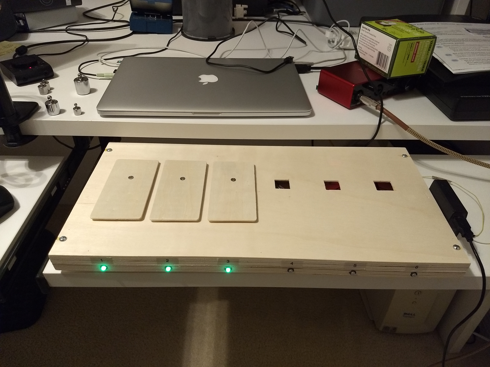
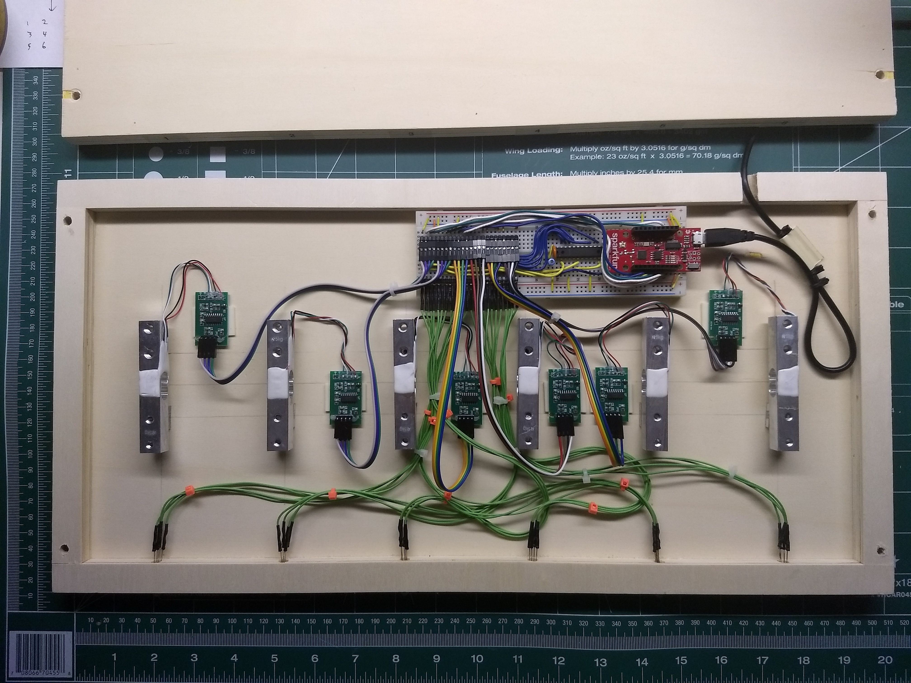
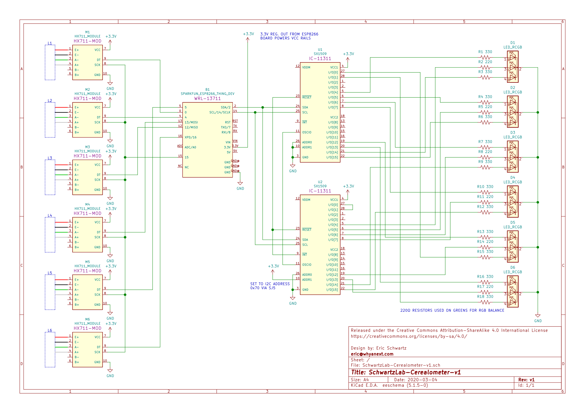
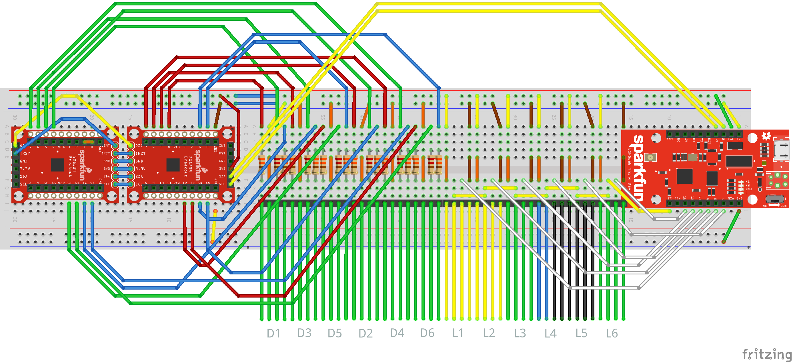

	Introducing...
	 
	
	
Think What's Inside the Box

## About this repo

This repo contains hardware specs and embedded firmware for the Cerealometer device, an IoT-enabled cereal monitoring solution designed to mitigate the impact of breakfast outages.

For general info about the Cerealometer app and its infrastructure, visit the [main repo here](https://github.com/ahtraddis/cerealometer).

## Draft outline/topics
* [ESP8266 Arduino Core](https://github.com/esp8266/Arduino). Supports ESP8266 dev in Arduino environment.
* Libraries used: [HX711](https://github.com/bogde/HX711), [FirebaseESP8266](https://github.com/mobizt/Firebase-ESP8266), [Statistic](https://playground.arduino.cc/Main/Statistics/), [LedControl](http://wayoda.github.io/LedControl/index.html)
* Configuring Visual Studio Code for Arduino Development ([YouTube](https://www.youtube.com/watch?v=FnEvJXpxxNM))
* Direct db access via Firebase used for realtime advantage, esp. to subscribe to events driven by app usage and avoid polling.
* Challenges: setting tare weight (no data online!) and resetting scales on powerup when items are present (can't tare).
* Caption: This is a tareable product.

## Photos

	
	
	

Parking your cereal is just like at the Whole Foods parking garage: Red means No, Green means Go!

## Overview/Challenge
- Track the weight changes in each port and send the data to the cloud
- Communicate port status via the RGB LEDs (Whole Foods parking garage style)
- Perform network discovery and self-configuration with minimal intervention
- Respond to app-driven events such as LED demonstration during onboarding, with minimal polling to cloud to minimize cost

## IoT Approach
While it would have been possible to design this as a standalone "appliance" with a powerful processor and tons of storage, as a learning exercise I opted for the IoT route, treating the device as connected I/O and leaving the smarts in the cloud.

## Circuit Description

The heart of the circuit is the ESP8266, a WiFi-connected microcontroller.

## Firmware

### ESP8266 Arduino Core

## Physical Construction
Since this is a learning project expected to evolve, just about everything is built around reuseable parts and modules, impermanently assembled. If that doesn't suit you, make a new plan, Stan!

### Mounting the load cells
The load cells used here work by measuring stress applied to a small  aluminum beam against which a strain gauge is mounted. When weight is applied, there's a small change in resistance which is amplified by the HX711 chip. To get an full-range signal, the cell must be mounted as shown.

As luck would have it, two of the ArtMinds framed pallet boards pressed together result in just the right thickness for a perfect load cell sandwich! Such a good fit, it's almost... ce-REAL. 🙄

I reused the screws and acrylic blocks that came with the MakerHawk kits, added nylon spacers, and nibbled out openings in the top of the shelf to get the wood plaques at the right height.

### Wiring the LEDs
I hate soldering, and avoid it when I can. Case in point: 24 LED legs whch need to be wired up to the SX1509 breakouts. So, I used SchmartBoard female jumpers, which are designed for header pins but have enough grip to stay on the LED legs.

## Building Your Own

## What You'll Need

### Electronic Components

Quan | Symbol | Item | Source | Datasheet
---: | --- | --- | --- | ---
1 | B1 | SparkFun ESP8266 Thing Dev Board (or Thing) | [SparkFun](https://www.sparkfun.com/products/13711) | [Hookup Guide](https://learn.sparkfun.com/tutorials/esp8266-thing-development-board-hookup-guide/hardware-overview)
6 | M[1-6] | MakerHawk 5kg load cell with HX711 amp module | [Amazon](https://www.amazon.com/gp/product/B07GQPV6C4/ref=ppx_yo_dt_b_asin_title_o02_s00?ie=UTF8&psc=1) | [HX711 PDF](https://cdn.sparkfun.com/datasheets/Sensors/ForceFlex/hx711_english.pdf)
2 | U[1-2] | SparkFun SX1509 16 Output I/O Expander Breakout | [SparkFun](https://www.sparkfun.com/products/13601) | [Datasheet](https://cdn.sparkfun.com/datasheets/BreakoutBoards/sx1509.pdf), [Hookup Guide](https://learn.sparkfun.com/tutorials/sx1509-io-expander-breakout-hookup-guide)
6 | D[1-6] | Common-cathode RGB LED |
12 | R[1, 3, 4, 6, 7, 9, 10, 12, 13, 15, 16, 18] | 1/8 W 330-ohm resistor
6 | R[2, 5, 8, 11, 14, 17] | 1/8 W 220-ohm resistor
6 | | 10-pin stackable header | [Amazon](https://www.amazon.com/gp/product/B0756KRCFX/ref=ppx_yo_dt_b_asin_title_o04_s01?ie=UTF8&psc=1)
4 | | 6-pin stackable header | [Amazon](https://www.amazon.com/gp/product/B0756KRCFX/ref=ppx_yo_dt_b_asin_title_o04_s01?ie=UTF8&psc=1)
| | | 0.1" extra-long breakaway header, right angle |
6 | | LED mounting clip |
1 | | Standard 830-point solderless breadboard |
1 | | Half-size solderless breadboard |
48 | | SchmartBoard female jumper wires, 8-12" sizes | [Amazon](https://www.amazon.com/Qty-10-Female-Jumpers-Headers/dp/B00K1IT2CI?ref_=ast_sto_dp)
1 | | USB cable w/ micro USB connector |

### Hardware and Supplies

- (2) ArtMinds 20" x 10" framed pallet board (or similar), available at [Michael's](https://www.michaels.com/unfinished-20in-x-10in-framed-pallet-board-by-artminds/10583614.html)
- (6) WoodPile Fun! 1/8" thick ~5-1/4" x 2-5/8" wood cut-out rectangles (Hobby Lobby)
- (4) 1-1/2" 10-32 nuts and bolts for case
- (6) 1/2" nylon spacer (Home Depot)
- Breadboard jumper wires
- 22 AWG hookup wire
- Adhesive-backed foam tape
- Zip ties
- Screwdriver, drill, bits, and my favorite tool ever, the [Nibbler](https://www.jameco.com/z/HT-204-R-Hanlong-Tools-Nibbling-Tool-for-Sheet-Metal_18810.html)!

### Nice-to-Have's
- A precision calibration weight set ([Amazon](https://www.amazon.com/gp/product/B07K7F7D8K/ref=ppx_yo_dt_b_asin_title_o07_s00?ie=UTF8&psc=1))

## License

This project is licensed under the MIT License - see the [LICENSE](LICENSE) file for details.

## About the author

Eric Schwartz is a self-described cereal entrepreneur who enjoys cereal, entrepreneuring, and describing himself in the third person. Write to him at eric@cerealometer.com for more details.