<div align="center">
	Introducing...
	<br>
	
	<p>A tareable product.</p>
</div>

## Cerealometer HW

This repo contains hardware specs, building instructions, and embedded firmware for Cerealometer, an IoT-enabled cereal measuring solution designed to mitigate the impact of breakfast outages.

For the Cerealometer app and its cloud infrastructure, visit the [main Cerealometer repo here](https://github.com/ahtraddis/cerealometer).

## Photos

<div>
	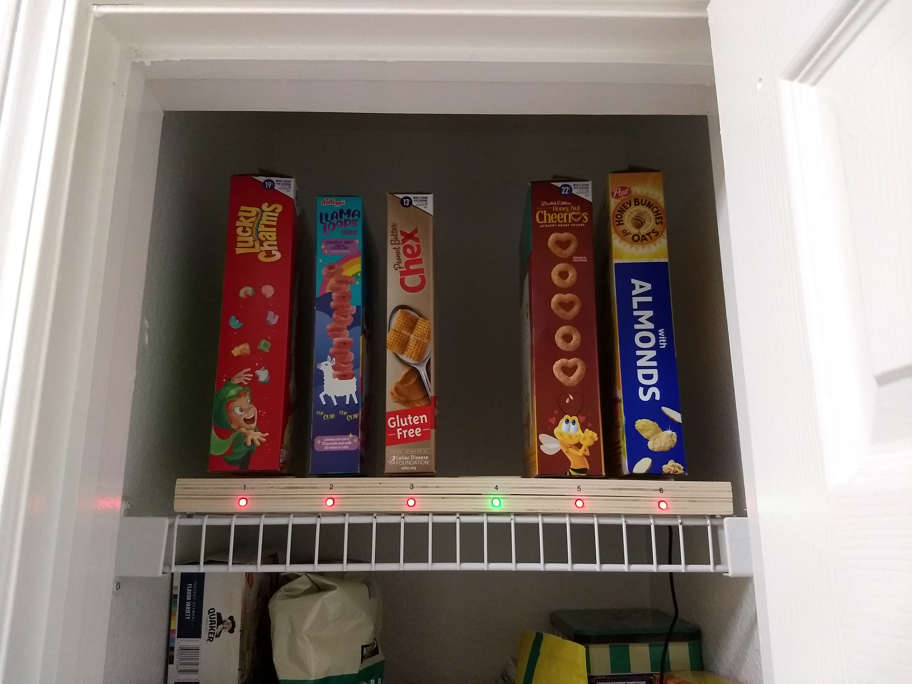
	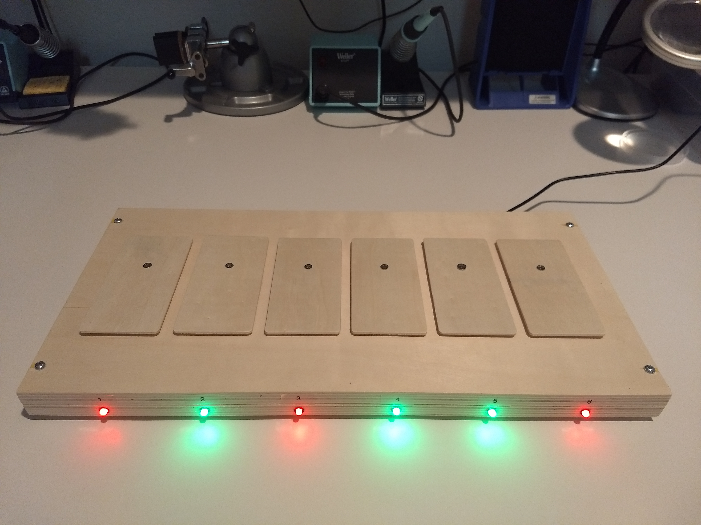
</div>
<sub>Parking your cereal is just like at Whole Foods: Red means No, Green means Go!</sub>

<p></p>
<div>
	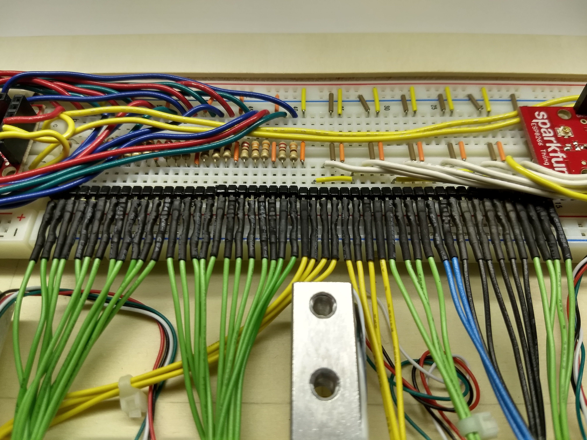
	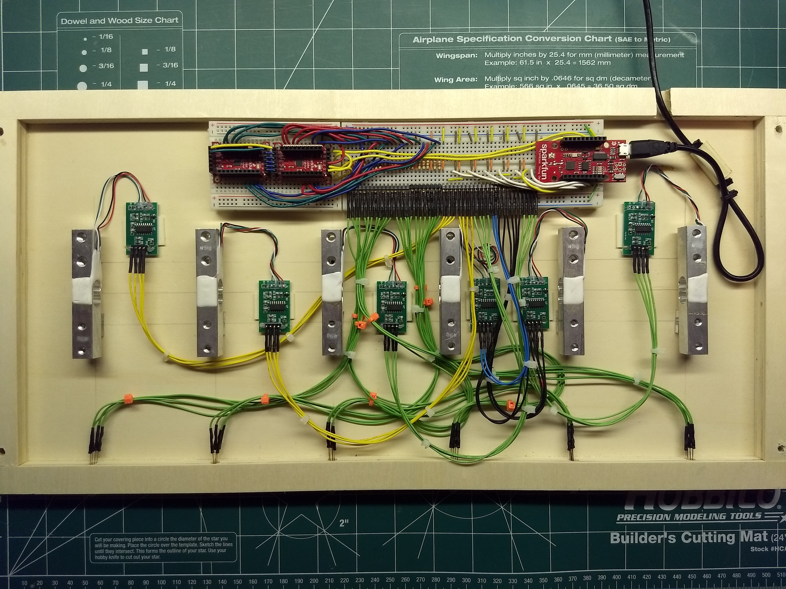
</div>
<sub>Wire we looking at this? Because beautiful!</sub>

## Device Functionality

While the app tracks your cereal's lifecycle, the device has a more low-level job description:

- Detect weight changes and object presence on each scale
- Upload data to the Google Firebase Realtime Database
- Receive and display realtime port status updates via the RGB LEDs
- Perform Wi-Fi network discovery and configuration via embedded web admin
- Calibrate and tare the scales

## IoT Style

While this project could also have been implemented as a standalone "appliance" with a  powerful processor, local database, and gobs of storage, for a learning exercise I went the IoT route, leaving the smarts in the cloud and treating the device as a relatively dumb box of sensors. (No offense, device.)

One key requirement was to be able to respond in realtime to app-driven events without constant polling to the cloud, both to keep the display in sync with the app state, and to minimize usage cost.

## Schematic Diagram


## Circuit Description

The circuit is built around the SparkFun ESP8266 Thing Dev Board, which is powered and programmed over USB via the 5V, TXD and RXD lines. The board's regulated 3.3V output powers the other ICs and modules via breadboard power rails.

Six 5-kg load cells, each wired to an HX711 24-bit analog-to-digital converter (ADC), interface with the ESP8266 via GPIO pins plus a common clock line (SCK).

The remaining GPIO pins control the I<sup>2</sup>C lines (SDA and SCL) of the SX1509 16-port I/O expanders U1 and U2, which in turn drive 6 common-cathode RGB LEDs (18 pins). Only half of the SX1509's pins (I/O 4-7 and 12-15) support pin "breathing" – a desirable LED effect – so they are allocated first to the red and green LEDs (12 pins), leaving two of the blue LEDs without this feature.

To synchronize LED timing for the SX1509's "blink" and "breathe" PWM effects, the nRESET lines must be brought low after setting a config bit in the RegMisc register, which causes the chip to reset its internal counters rather than perform a power-on reset. However, we have run out of useable I/O pins on the ESP8266! My workaround was to configure one of the interrupt outputs (INT) to reset both ICs when this sync is needed.

## Breadboard Layout


For optimal tinkerability, I soldered long stackable headers on the boards, applied a liberal amount of breakaway header, and used a spaghetti plate worth of female jumpers for the LED wiring. On the SX1509s, note that only the inner I/O pin rows extend through to the breadboard, but not the outer GND/VCC rows or the 6-pin input and control headers.

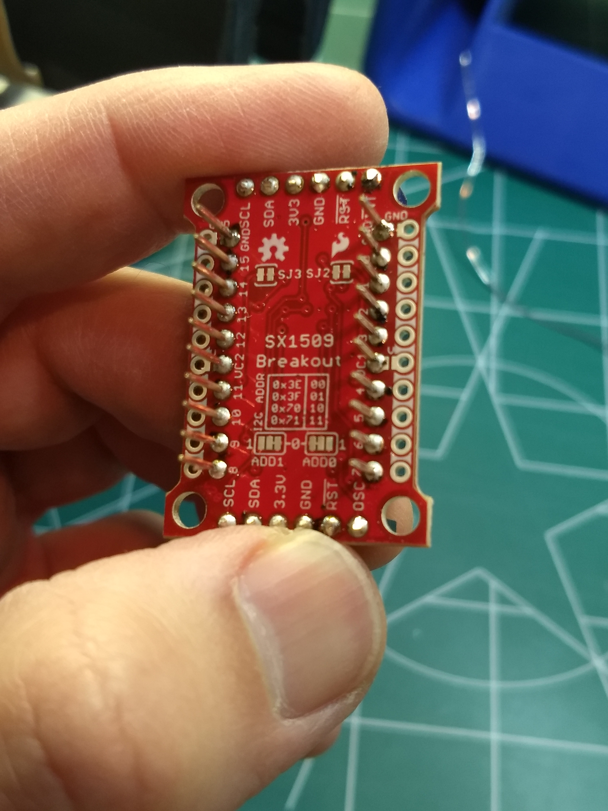

## Firmware

### Development Environment

There are several options available for programming the ESP8266, but I chose the Arduino environment to take advantage of some great ESP8266 tools as well as other useful libraries.

#### Arduino IDE

SparkFun published a fabulous guide which includes instructions for setting up the Arduino IDE. Check it out!

 * [ESP8266 Thing Development Board Hookup Guide - Setting Up Arduino](https://learn.sparkfun.com/tutorials/esp8266-thing-development-board-hookup-guide/setting-up-arduino)

#### Visual Studio Code

If you use Visual Studio Code, I recommend setting it up for Arduino development, otherwise you can use the standard Arduino IDE (which needs to be installed regardless).
* [Configuring Visual Studio Code for Arduino Development](https://www.youtube.com/watch?v=FnEvJXpxxNM) (YouTube)

### Arduino Libraries

You'll need to install the following libraries either via the Arduino IDE or the `Arduino: Library Manager` command in Visual Studio Code.

| Library | Description |
--- | ---
| [ESP8266 Arduino Core](https://github.com/esp8266/Arduino) | ESP8266 core for Arduino.
| [FirebaseESP8266](https://github.com/mobizt/Firebase-ESP8266) | Firebase Realtime Database Arduino Library for ESP8266.
[HX711](https://github.com/bogde/HX711) (optional) | Interfaces with the Avia Semiconductor HX711 24-Bit Analog-to-Digital Converter (ADC).
[HX711-multi](https://github.com/compugician/HX711-multi) | A fork of the HX711 library which supports multiple modules using a shared clock line.
[Statistic](https://playground.arduino.cc/Main/Statistics/) | An easy to use statistics library designed with sensor data in mind.

## Getting Started

### Firebase Setup

* Set up your Firebase environment and create a new Realtime Database (see the [main repo](https://github.com/ahtraddis/cerealometer) for details)
* Deploy HTTP Cloud Functions (see `functions/index.js` in the [main repo](https://github.com/ahtraddis/cerealometer))
* Add command line helpers to your `.bash_profile` for testing:

```bash
export CEREALOMETER_HTTP_FUNCTION_BASEURL="http://us-central1-my-project-0123456789.cloudfunctions.net"
export CEREALOMETER_DEVICE_ID="-AbBcC12DEdF3efgG4H5"

function setWeight()
{
   local device_id="$CEREALOMETER_DEVICE_ID" slot="" weight_kg="" OPTIND
   while getopts 'hd:s:w:' opt; do
      case "${opt}" in
         h)
            echo "Usage:"
            echo "  setWeight -h Display this help message."
            echo "  setWeight [-d device_id (default '$CEREALOMETER_DEVICE_ID')] [-s slot] [-w weight_kg]"
            ;;
         d) device_id="${OPTARG}" ;;
         s) slot="${OPTARG}" ;;
         w) weight_kg="${OPTARG}" ;;
      esac
   done
   shift $((OPTIND -1))

   if [ -n "${device_id}" -a -n "${slot}" -a -n "${weight_kg}" ]; then
      curl \
         -X POST \
         -H "Content-Type: application/json" \
         -d "{\"device_id\":\"${device_id}\", \"slot\": \"${slot}\", \"weight_kg\": ${weight_kg}}" \
         "$CEREALOMETER_HTTP_FUNCTION_BASEURL/setWeight"
   fi
}
```

### Arduino Setup

* Clone this repo to your local machine
```
git clone https://github.com/ahtraddis/cerealometer-hardware.git
```
* Create a new Arduino sketch via the Arduino IDE or the Arduino commands in Visual Code Studio
* Import `cerealometer.ino` and `.h` files into the sketch
* Install the libraries listed above
* Verify and upload the sketch to the ESP8266

### Device Setup

On bootup, the device will attempt to establish a Wi-Fi connection if credentials have been entered in Settings. Otherwise it will start up its own access point.
* Connect to the "CerealometerAP" access point and browse to `192.168.4.1` to configure your Wi-Fi and Firebase settings. See `config.h` for password.
* Calibrate and tare the scales using a 0.1 kg reference weight.

<div>
	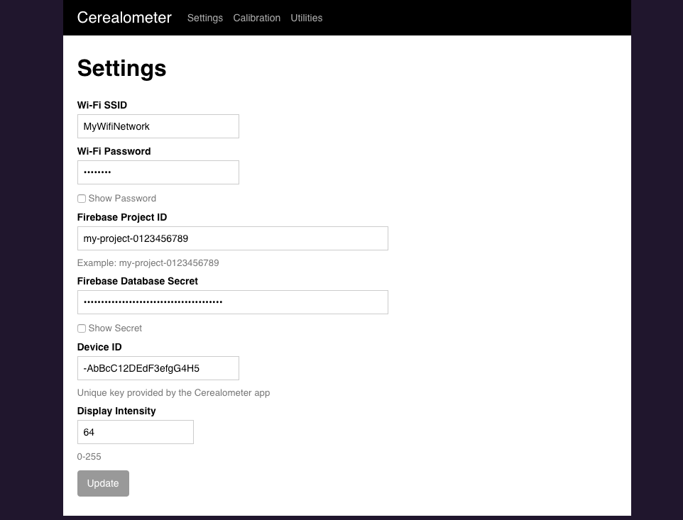
	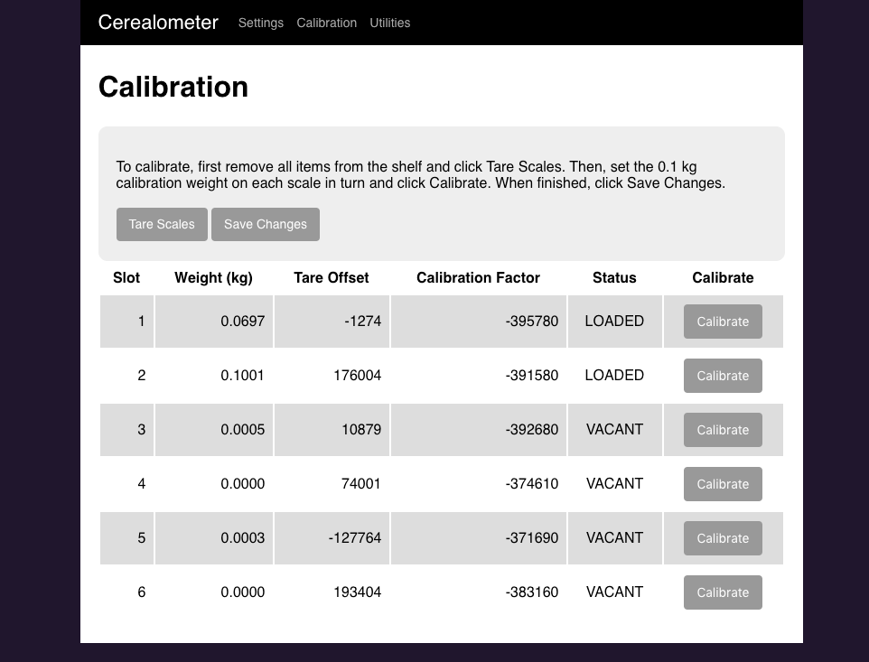
</div>

# Building Your Own

Since this is a learning project I expect will evolve, just about everything is built around reuseable parts and modules, impermanently assembled. Stackable headers are your friend!

### A Question of Scale (get it?)

There are several ways to scale this project up or down, depending on your purpose.

The enclosure I "designed" (stumbled upon at Michael's) was a good fit for my pantry, as it's wide enough for 6 cereal boxes, and it satisfyingly used up all of the I/O pins available on the ESP8266 board.

To save cost or to simplify, you can use fewer ports – the app will support it. If you want more than 6 (and if you do, we need to talk), you may need to adapt the HX711 or HX711-multi libraries to operate through the I/O expander pins rather than the built-in GPIO pins.

You can also scale down the LED display, use discrete LEDs instead of RGB ones, or eliminate it. Altogether. (And you say??)

## What You'll Need

### Electronic Components

Quan | Symbol | Item | Source | Datasheet
---: | --- | --- | --- | ---
1 | B1 | SparkFun ESP8266 Thing Dev Board | [SparkFun](https://www.sparkfun.com/products/13711) | [Hookup Guide](https://learn.sparkfun.com/tutorials/esp8266-thing-development-board-hookup-guide/hardware-overview)
6 | M[1-6] | MakerHawk 5kg load cell with HX711 amp module | [Amazon](https://www.amazon.com/gp/product/B07GQPV6C4/ref=ppx_yo_dt_b_asin_title_o02_s00?ie=UTF8&psc=1) | [HX711 PDF](https://cdn.sparkfun.com/datasheets/Sensors/ForceFlex/hx711_english.pdf)
2 | U[1-2] | SparkFun SX1509 16 Output I/O Expander Breakout | [SparkFun](https://www.sparkfun.com/products/13601) | [Datasheet](https://cdn.sparkfun.com/datasheets/BreakoutBoards/sx1509.pdf), [Hookup Guide](https://learn.sparkfun.com/tutorials/sx1509-io-expander-breakout-hookup-guide)
6 | D[1-6] | Common-cathode RGB LED |
12 | R[1, 3, 4, 6, 7, 9, 10, 12, 13, 15, 16, 18] | 1/8 W 330-ohm resistor
6 | R[2, 5, 8, 11, 14, 17] | 1/8 W 220-ohm resistor
6 | | 10-pin stackable header | [Amazon](https://www.amazon.com/gp/product/B0756KRCFX/ref=ppx_yo_dt_b_asin_title_o04_s01?ie=UTF8&psc=1)
4 | | 6-pin stackable header | [Amazon](https://www.amazon.com/gp/product/B0756KRCFX/ref=ppx_yo_dt_b_asin_title_o04_s01?ie=UTF8&psc=1)
| | | 0.1" extra-long breakaway header, right angle (or roll your own like I did) |
6 | | LED mounting clip |
1 | | Standard 830-point solderless breadboard |
1 | | Half-size solderless breadboard |
48 | | SchmartBoard female jumper wires, 8-12" sizes | [Amazon](https://www.amazon.com/Qty-10-Female-Jumpers-Headers/dp/B00K1IT2CI?ref_=ast_sto_dp)
1 | | USB cable w/ micro USB connector |

### Materials and Supplies

- (2) ArtMinds 20" x 10" framed pallet board (or similar), available at [Michael's](https://www.michaels.com/unfinished-20in-x-10in-framed-pallet-board-by-artminds/10583614.html)
- (6) WoodPile Fun! 1/8" thick ~5-1/4" x 2-5/8" wood cut-out rectangles (Hobby Lobby)
- (4) 1-1/2" 10-32 nuts and bolts for enclosure
- (6) 1/2" nylon spacer (Home Depot)
- Breadboard jumper wires
- 22 AWG hookup wire
- Adhesive-backed foam tape
- Zip ties
- Screwdriver, drill, bits, stripper (tool), and my favorite handtool ever, the [Nibbler](https://www.jameco.com/z/HT-204-R-Hanlong-Tools-Nibbling-Tool-for-Sheet-Metal_18810.html)!

### Nice-to-Have's

- A precision calibration weight set ([Amazon](https://www.amazon.com/gp/product/B07K7F7D8K/ref=ppx_yo_dt_b_asin_title_o07_s00?ie=UTF8&psc=1))

## Physical Construction

Here are some tips to recreate what I've built, but be warned it's not a comprehensive guide. Some creativity required.

### Build-A-Box

<div>
	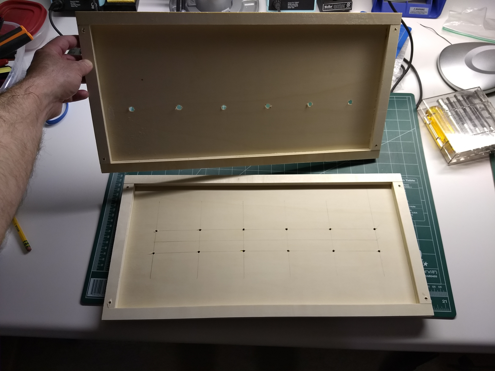
	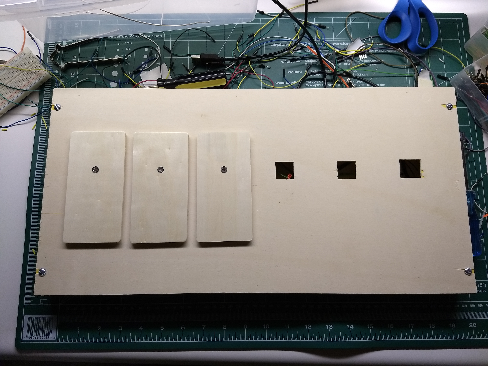
</div>
<sub>I drilled starter holes in the top board, then widened them with the nibbler.</sub>
<p></p>

* Decide how many scales you want and where you want them.
* First mark and drill the holes to bolt the pallet boards together, to ensure alignment.
* Mark up the boards for the mounting holes on the lower half, and holes or cutouts on the upper half.
* Drill the off-center holes in the wood plaques so that the plaques are centered on the top surface.

If you want LEDs on the front like mine, drill those holes first so when you accidentally split the wood panel, you'll be less invested and will feel less shame when you go back into Michael's. (You wooden't do that, wood you?)

### Mount the Load Cells

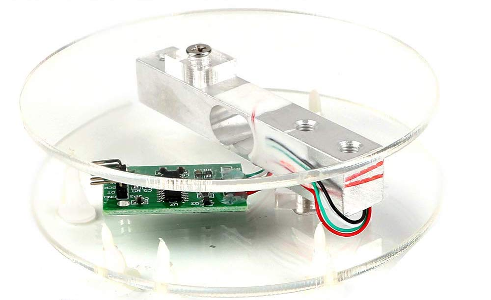

The load cells used here work by measuring the stress applied to a small  aluminum beam against which a strain gauge is mounted. When weight is applied, there's a small change in resistance which is amplified by the HX711. To get a full-range signal, the cell must be mounted as shown above so that the load compresses the strain gauge adequately.

As luck would have it, two of the ArtMinds framed pallet boards pressed together result in just the right thickness for a perfect load cell sandwich! Such a good fit, it's almost... ce-REAL. 🙄

I reused the screws and acrylic blocks that came with the MakerHawk kits, added nylon spacers, and nibbled out openings in the top of the shelf to position the wood plaques at the right height.

### Secure the HX711s

* Be careful not to tug on the load cell wires or disturb the epoxy.
* Keep the wires twisted for noise rejection.
* Use small pieces of foam tape on the back of each module to secure them. But do it after you have shop-vac'd the sawdust from the kitchen table. (Dinner's almost ready, btw.)

### Wire the LEDs

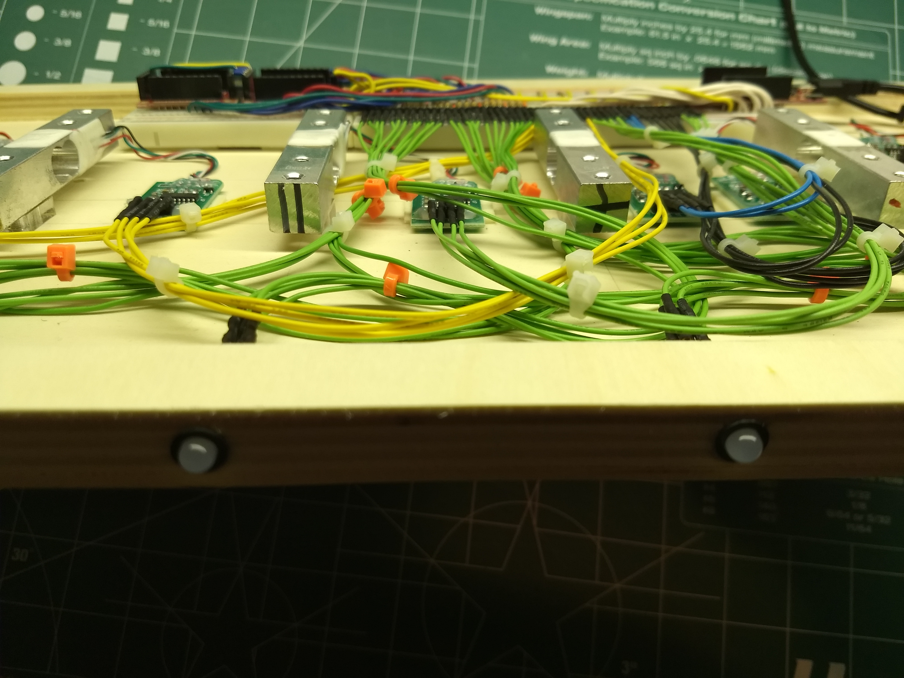

I hate soldering, and I avoid it when I can. Case in point: the 24 LED legs which need to be wired up to the SX1509 breakout boards. I used SchmartBoard female jumpers, which are designed for header pins but have enough grip to stay on the LED legs. Use zip ties for strain relief.

### Batten Down the Breadboards

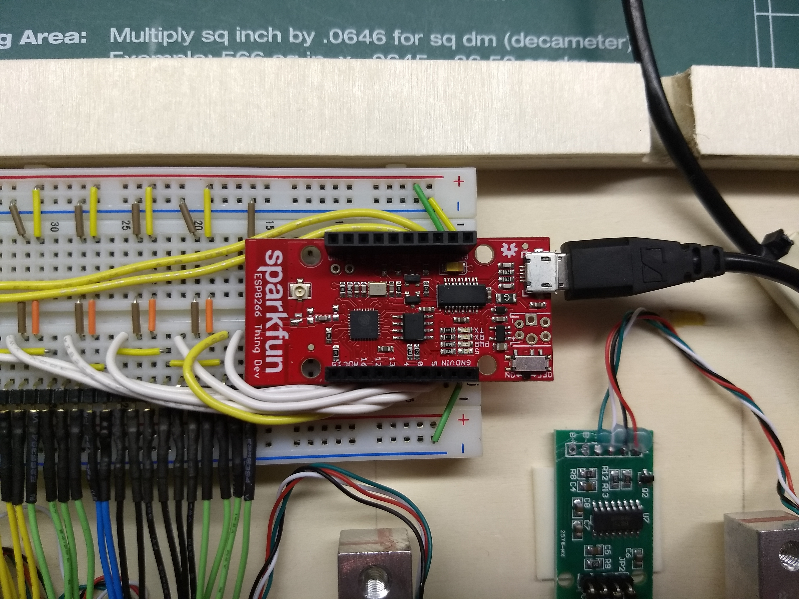

After you've wired up the circuit, as beautifully illustrated in my breadboard diagram, be sure to smoke-test the firmware before securing the breadboards with foam tape. Otherwise Murphy will guarantee trouble and you'll find yourself prying them back off with a screwdriver, which risks damaging the backing.

### Closing Up the Patient

When ready, bolt the pallet boards together... and don't forget to hook up a USB cable. Use the spacers and screws from the MakerHawk kits to mount the wooden plaques, which should float about 1/8" above the top surface without touching any part of the case.

### TA-DA!

Your Cerealometer device is ready. Plug it in, enjoy the dazzling LED show, and watch your `/ports/<DEVICE_ID>` node in Firebase to bear  witness to weight updates.

## License

This project is licensed under the MIT License - see the [LICENSE](LICENSE) file for details.

## About the author

Eric Schwartz is a self-described cereal entrepreneur who enjoys cereal, entrepreneuring, and describing himself in the third person. Write to him at eric@cerealometer.com for the address to which you should send all of your money.
